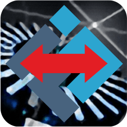
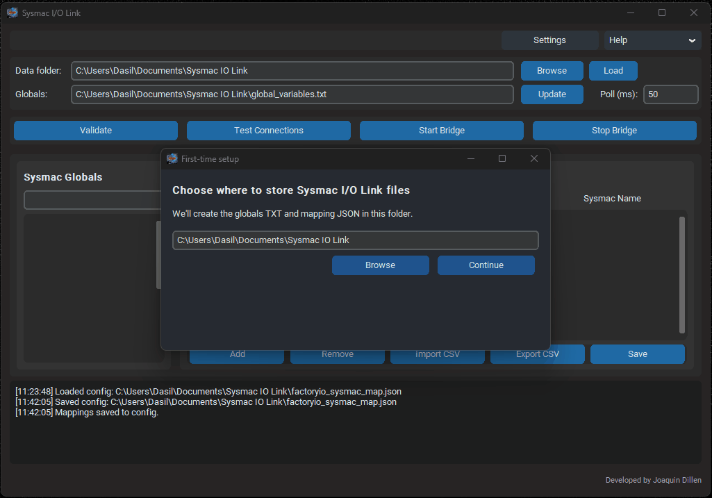

# Sysmac I/O Link (Release)

  

This repository hosts **public Windows releases** of **Sysmac I/O Link**.

Sysmac I/O Link bridges **Factory I/O** with the **Omron Sysmac Studio Simulator** so students can practice PLC workflows **without physical hardware**.

## Download

Go to **Releases** and download the latest `Sysmac-IO-Link.exe`.

## Requirements

- Windows 10/11
- Factory I/O (SDK backend for Ultimate, or Modbus TCP backend)
- Omron Sysmac Studio with Simulator

## Quick Guide (GIFs)

### First-time setup

Alternative (without CX-Designer export):

.gif)

### Create and save mappings

### Test connections and start bridge

## License

PolyForm Noncommercial 1.0.0 (see `LICENSE`).

## Third-party licenses

- Factory I/O SDK: Microsoft Public License (Ms-PL). See `LICENSES/FactoryIO-SDK-LICENSE.txt`.

[//]: # (This is a binary-only distribution.)
[//]: # (For source code, issues, and documentation, see:)
[//]: # (https://github.com/JoaquinDillen/sysmack-io-link)
