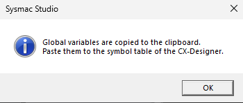
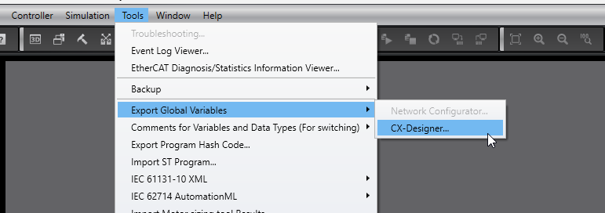
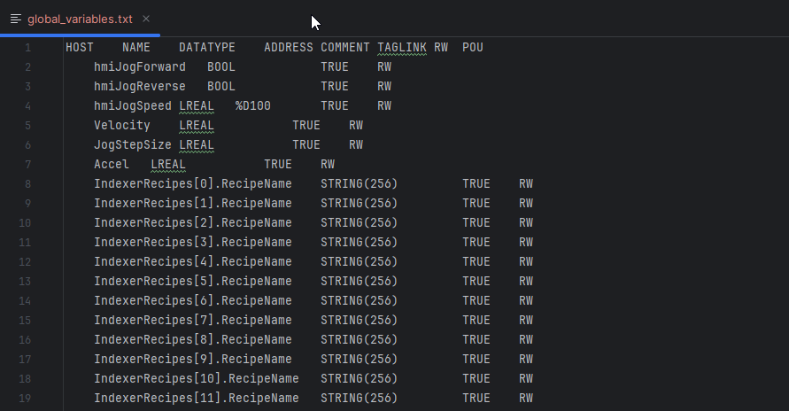

# Sysmac I/O Link (Release)

  

This repository hosts **public Windows releases** of **Sysmac I/O Link**.

Sysmac I/O Link bridges **Factory I/O** with the **Omron Sysmac Studio Simulator** so students can practice PLC workflows **without physical hardware**.

## Download

Go to **Releases** and download the latest `Sysmac-IO-Link.exe` (or `.zip`).

## Requirements

- Windows 10/11
- Factory I/O Ultimate Edition (SDK access)
- Omron Sysmac Studio with Simulator

## Quick Guide

1. Open Sysmac Studio and export globals: `Tools -> Export Global Variables -> CX-Designer`.

2. Copy the exported content.

3. Open `Sysmac-IO-Link.exe`.
4. On first run, choose a data folder.
5. In `Sysmac Globals Setup`, paste the exported globals and save.
6. Build mappings in the app and press `Save`.
7. Use `Test Connections`, then `Start Bridge`.

## License

PolyForm Noncommercial 1.0.0 (see `LICENSE`).

## Third-party licenses

- Factory I/O SDK: Microsoft Public License (Ms-PL). See `LICENSES/FactoryIO-SDK-LICENSE.txt`.

## Notes

This is a **binary-only** distribution. For source code, issues, and documentation, see:
https://github.com/JoaquinDillen/sysmack-io-link
